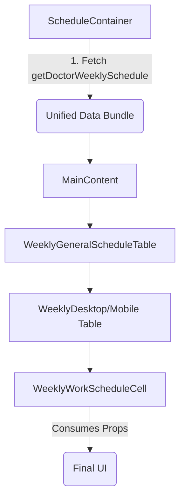

# Unified Weekly Schedule Optimization (v2)

This document describes the architectural changes and implementation details of the optimized doctor weekly schedule rendering, which reduced the number of server-side API calls from ~30 down to **1 single request**.

## 🚀 The Problem: API Waterfall

Previously, the doctor's schedule page fetched availability data at the lowest component level (`WorkScheduleCell`). For a standard weekly view:

- **7 days** in a week.
- **3-5 services** (Khám thường, Khám chuyên gia, v.v.).
- **5-6 cell types** per row (Ca, Giờ, Phòng, v.v.).

Even with React `cache()`, this resulted in dozens of evaluating components and multiple I/O bursts, leading to high **TTFB** and potential connection pool exhaustion.

## 💡 The Solution: Unified Weekly Bundle

The "Optimized v2" architecture shifts data fetching to the **Container Level** (`ScheduleContainer`).

### High-Level Flow (Mermaid)



## 🛠️ Implementation Details

### 1. New Data Schema (`WeeklyScheduleResponse`)

The new API expects a unified response grouped by date.

**Location**: `src/app/bac-si/[doctor]/lich-kham/_api/types.ts`

```typescript
export interface WeeklyShift {
  id: string;
  shiftName: string;
  startTime: string;
  endTime: string;
  roomName: string;
  service: {
    id: string;
    name: string;
    price: number;
  };
  status: "AVAILABLE" | "FULL" | "OFF";
}

export interface WeeklyDay {
  date: string; // DDMMYYYY
  shifts: WeeklyShift[];
}
```

### 2. Mock Data (Development)

Mock data is now provided as a TypeScript file to ensure type safety across environments and avoid JSON import issues in Turbopack.
**Path**: `src/app/bac-si/[doctor]/lich-kham/_api/mock-data/weekly_schedule_data.ts`

### 3. Switching Mechanism (Feature Flag)

We maintain backward compatibility during the stability phase. The toggle is located in `ScheduleContainer.tsx`:

```typescript
const USE_WEEKLY_API_V2 = true; // Set to false to revert to 30-API method
```

## 📂 Component Map

| New Component                | Role           | Logic                                                      |
| :--------------------------- | :------------- | :--------------------------------------------------------- |
| `WeeklyGeneralScheduleTable` | Main Entry     | Routes to Desktop/Mobile versions.                         |
| `WeeklyDesktopScheduleTable` | Desktop Grid   | Renders the 6-column grid using CSS Grid.                  |
| `WeeklyWorkScheduleCell`     | Leaf Component | **Stateless.** No API calls. Renders pre-processed shifts. |

## ⚠️ Maintenance Notes

- **SCSS Imports**: Always use `./` relative paths for `general-schedule-table.module.scss` as the components are siblings in the same directory.
- **Deduplication**: The `WeeklyWorkScheduleCell` expects the backend to have already performed any necessary shift merging or deduplication.
- **Real API Integration**: Once the backend endpoint is ready, update `getDoctorWeeklySchedule.api.ts` to replace the `USE_MOCK` block with a real `api.post/get` call.

---

_Created by: Antigravity Senior Developer_
_Status: Experimental / Stable-ready_
